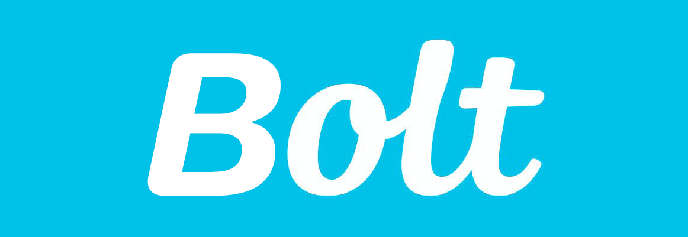

#### Bolt is a Slack bot for Wolt group orders.

### How does it work?
As soon as a Wolt group link is sent to a channel it is part of, 
it joins the group and begins monitoring what each participant has ordered.
Once the order has been purchased, 
a message will be sent indicating how much each participant is required to pay to the group's host (including delivery rate). 
It will even keep reminding the participants to pay until they've marked themselves as paid.

## Features
* Automatic detection of Wolt group links shared to a Slack channel
* Automatic monitoring of participants' ordered items and sending how much each participant has to pay, including delivery rate
* It will try to automatically match the Wolt user to a Slack user and tag the relevant user. In case no matching Slack user is found, an admin can add a custom user with `/add-user` command
* Per-order debts reminders

## Installation
To install, you need an endpoint running Bolt server and a Slack app.
I provided a deployment for Kubernetes with all the necessary configuration to run Bolt,
but you may run it wherever you want as long as it has a static IP / DNS leading to Bolt.

Here are the basic steps to install Bolt:
1. Deploy Bolt Slack app. [See detailed instructions here](docs/installation/slack_app.md).
2. Run Bolt server. [See how to run Bolt with Kubernetes](./docs/installation/k8s.md).
3. Invite Bolt to every channel you wish to share Wolt group link in (using `/add` command)
4. Start sharing Wolt group links